<!-- ══════════════════════════════════════════════════════════════════
  DAVIDDANS · perfil readme — "una sesión de terminal"
  whoami → fastfetch → tree → nmap -sV daviddans → exit 0
  🎨 paleta "SynthNight Mocha" · 🌐 multi-plataforma · guía: COMO_USAR.md
  ✏️ pendientes: {{TU_STEAM}} y {{TU_INSTAGRAM}} del contacto (COMO_USAR §5)
 ══════════════════════════════════════════════════════════════════ -->

<!-- ══ $ whoami ══ la cabecera (header.svg) lleva el prompt, la escena
     synthwave y el typing animado; se regenera con tools/generar_header.py -->

<!-- ═══════════════ $ fastfetch ═══════════════
     Panel propio (tools/generar_fastfetch.py): logo de Arch, tu info,
     tecleo animado y 10 s de pausa para leerlo.

     Es un <picture> porque el markdown de GitHub no puede reordenar la
     maquetación (no hay CSS ni media queries), pero SÍ deja cambiar la
     imagen según el ancho: en pantallas estrechas sale la versión
     estrecha (420×452, una columna) y en anchas la versión ancha
     (780×323, con el about_me.md en segunda columna), que ocupa el hueco
     que antes era tu foto. -->

  <picture>
    <source media="(max-width: 700px)" srcset="./assets/fastfetch.svg">
    
  </picture>

<i>"Ingeniero en potencia, desgraciado en acto."</i>

<!-- BEGIN TAGS:HERO -->
<table border="0" width="100%">
        <tr>
          <td width="34%" valign="top" align="center">
      
<code>~/identidad</code>  
  
 

      
<code>~/.soft-skills</code>  
 
  
 

          </td>
          <td width="33%" valign="top" align="center">
      
<code>~/.hobbies/tech</code>  
 
 
  
 
 
 

          </td>
          <td width="33%" valign="top" align="center">
      
<code>~/.hobbies</code>   
  
  
  

          </td>
        </tr>
      </table>
<!-- END TAGS:HERO -->

  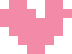
  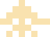
  
  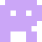
  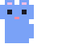
  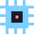
  
  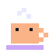

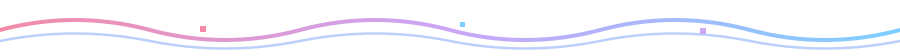

<!-- ═══════════════ $ tree ~/stack ═══════════════ -->
`daviddans@arch:~$ tree ~/stack/ -L 2`

<table border="0" width="100%">
  <tr>
    <td width="50%" valign="top">
      <code>├── languages/</code> 
      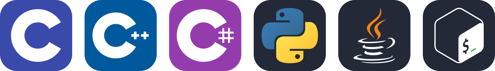 
      <code>│&nbsp;&nbsp;&nbsp;└── learning/</code> 
      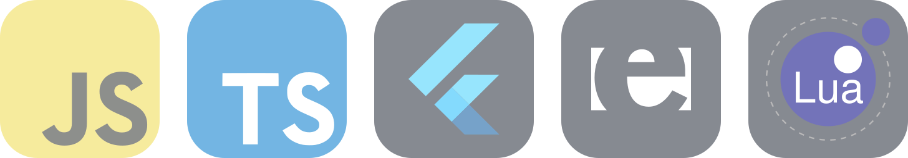  
      <code>├── dev/</code> 
      <code>│&nbsp;&nbsp;&nbsp;├── tools/</code> 
      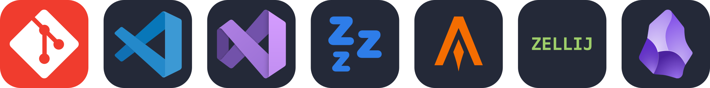 
      <code>│&nbsp;&nbsp;&nbsp;├── frameworks/</code> 
      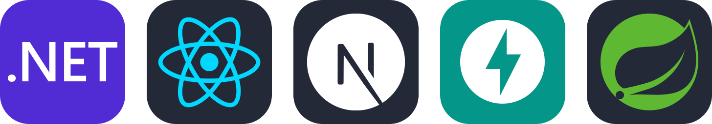 
      <code>│&nbsp;&nbsp;&nbsp;├── py-libs/</code> 
      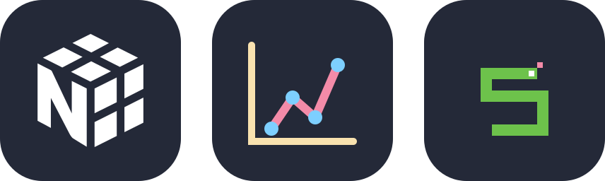 
      <code>│&nbsp;&nbsp;&nbsp;└── ml/</code> 
      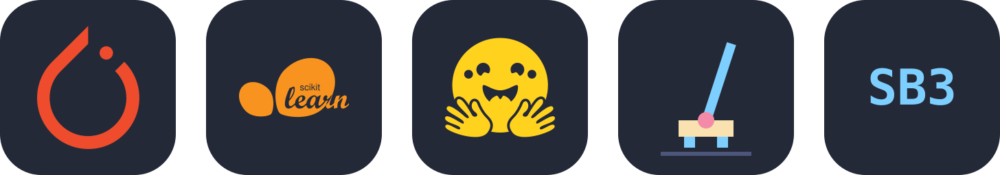  
      <code>├── games/</code> 
      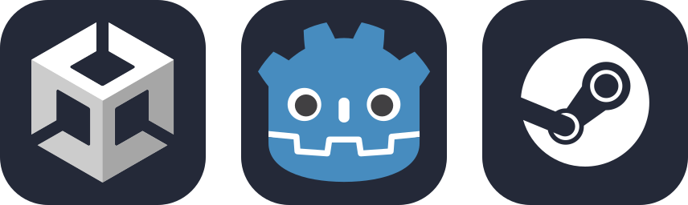
    </td>
    <td width="50%" valign="top">
      <code>├── infra/</code> 
      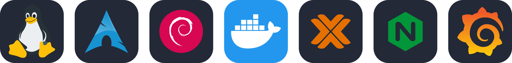 
      <code>│&nbsp;&nbsp;&nbsp;├── ai/</code> 
      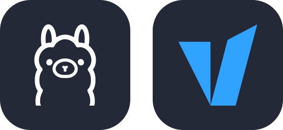 
      <code>│&nbsp;&nbsp;&nbsp;├── network/</code> 
      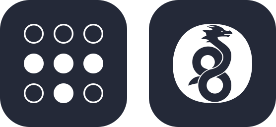 
      <code>│&nbsp;&nbsp;&nbsp;└── hardware/</code> 
      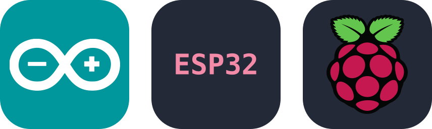  
      <code>├── design/</code> 
      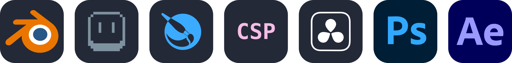  
      <code>├── maker/</code> 
      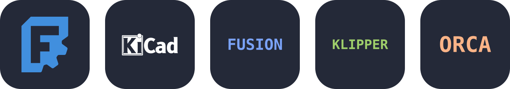
    </td>
  </tr>
</table>

<!-- ═══════════════ $ nmap -sV daviddans ═══════════════
     El contacto es un escaneo de puertos: cada puerto abierto es una de
     tus cosas, con el puerto real de cada servicio (8006 Proxmox, 9100 la
     impresora, 51820 WireGuard…). Se genera con tools/generar_nmap.py. -->
`daviddans@arch:~$ nmap -sV -T4 daviddans`

  

  
  
  
  
  

<!-- ═══════════════ EOF ═══════════════ -->
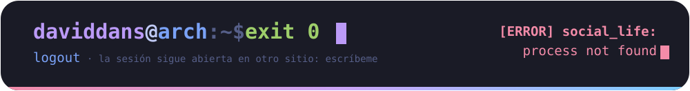
